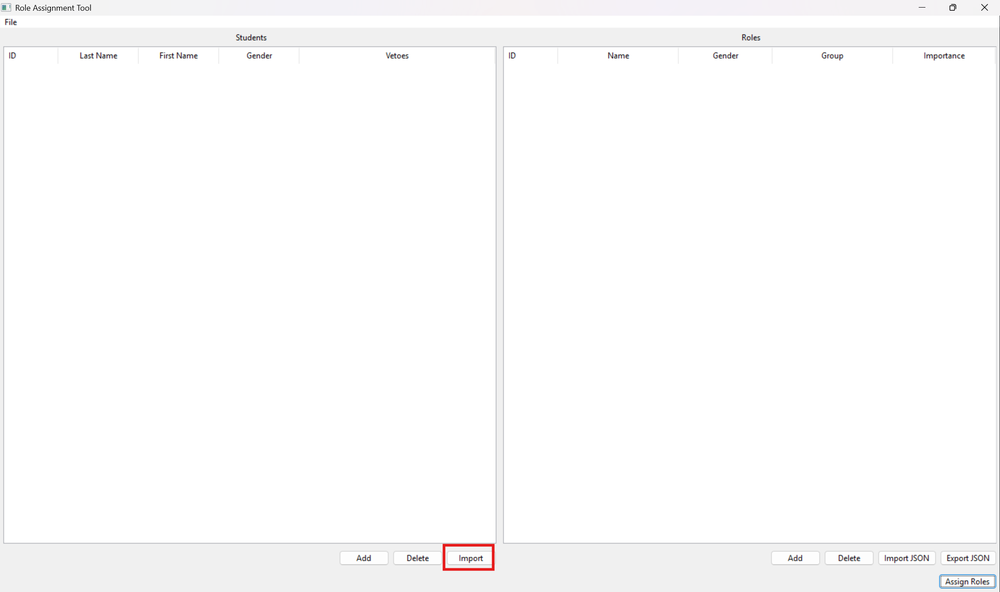
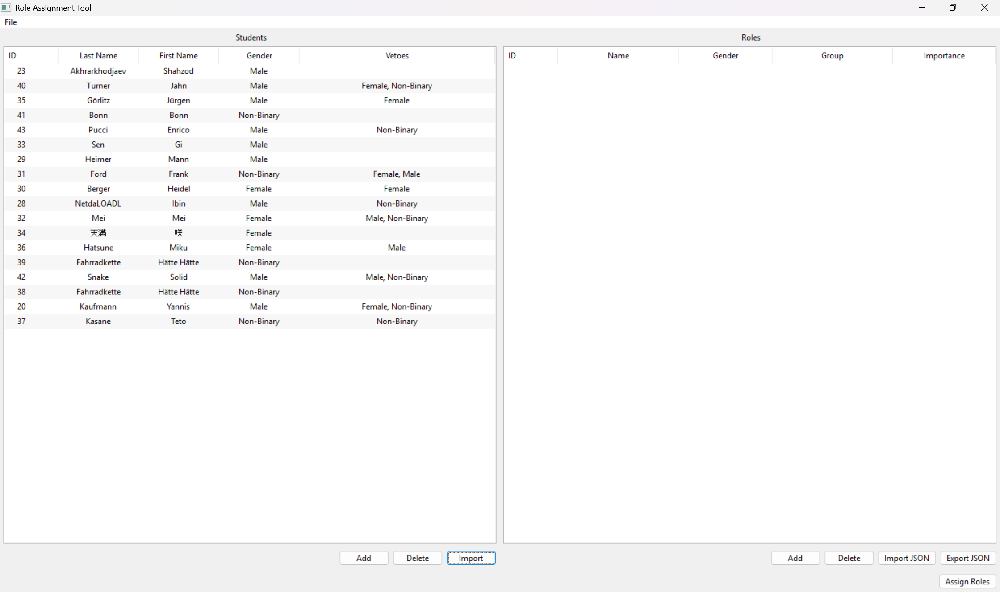
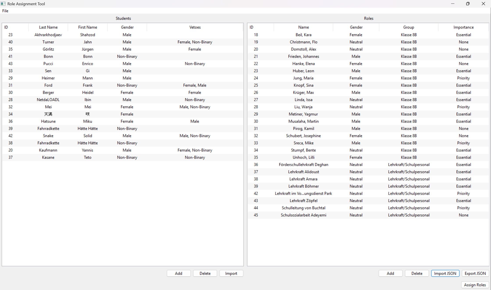
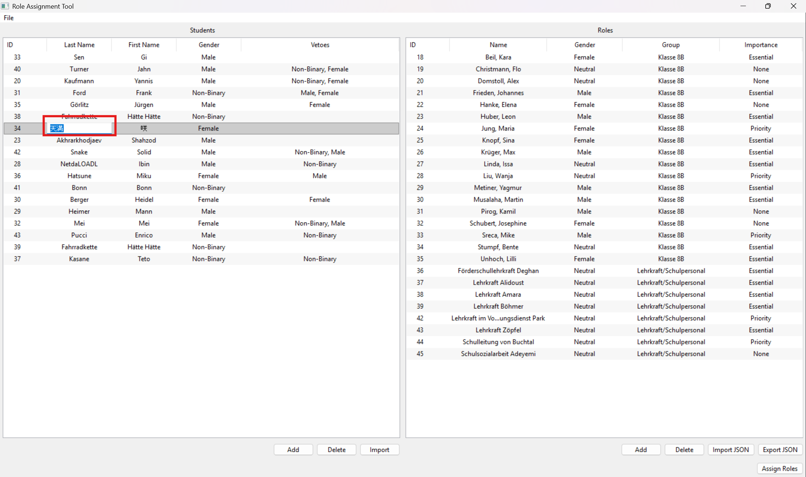
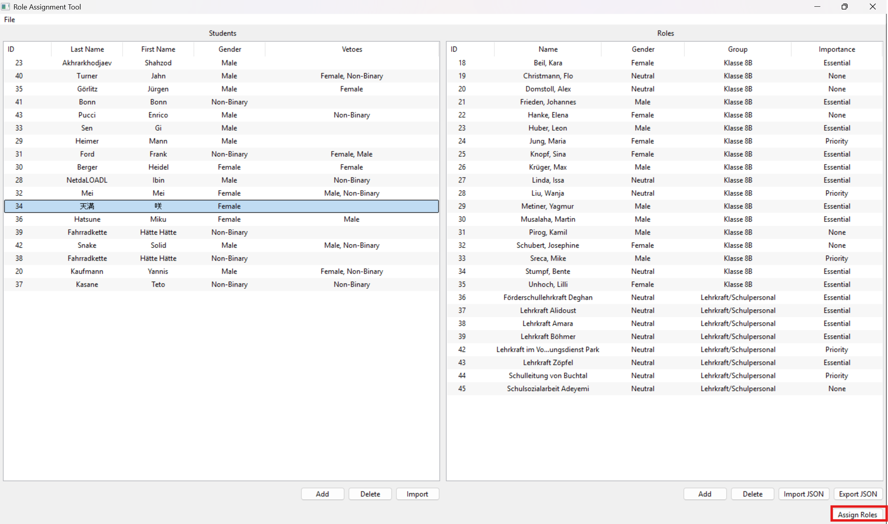
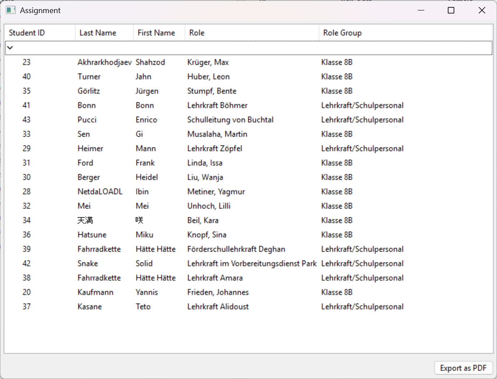

= Getting Started

- Click the "Import" button below the student editor panel on the left side of the application.

- Select the file exported from LimeSurvey.

- The list of students should then appear in the panel.

- Select a role file.

CAUTION: Only select one of the provided role files! These can be found in the ''roles'' folder.

- The available roles should then be visible in the panel.

- In both the student and role editor panels, edits can easily be made by clicking on the fields.

- When the input data as shown in the role and student editor panels looks right, click the "Assign Roles" button.

- The assignment process is computationally intensive and might take up to a minute.

- After the assignment is done calculating, the result will be presented in a separate window. In the case of an error, an error will be displayed instead.

The output window has a button to export the results as a PDF. The PDF file contains the assignment table.