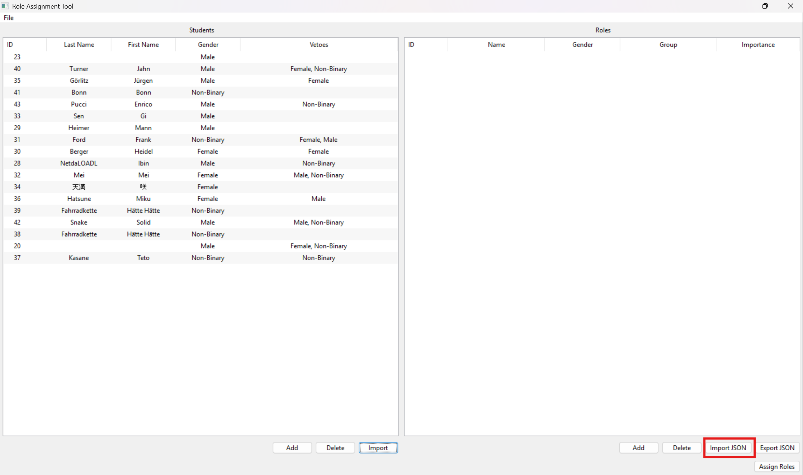

# Getting Started

Click the "Import" button below the student editor panel on the left side of the application.

Select the file exported from LimeSurvey.

The list of students should then appear in the panel.

Click the import button below the role editor on the right side of the application.

Select a role file.

> Take care to only select one of the provided role files! These can be found in the 'roles' folder.

The available roles should then be visible in the panel.

In both the student and role editor panels, edits can easily be made by clicking on the fields.

When the input data as shown in the role and student editor panels look right, click the "Assign Roles" button.

The assignment process is computationally intensive and might take up to a minute. 

After the assignment is done calculating, the result will be presented in a separate window. In the case of an error, an error will be displayed instead.

The output window has a button to export the results as a PDF. The PDF file contains the assignment table.